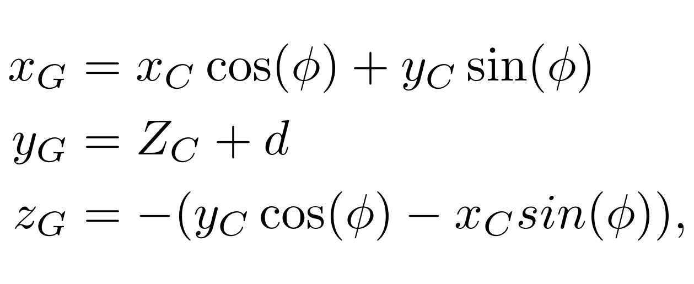

# IceShelf
This repository holds the code for the in-ice simulation part of the FAERIE framework, reported in
* **Simulation of in-ice cosmic ray air shower induced particle cascades**<br/>
  *De Kockere, S., de Vries, K. D., van Eijndhoven, N. and Latif, U. A. 2022, Phys. Rev. D 106, 043023* <br/>
  [journal](https://doi.org/10.1103/PhysRevD.106.043023) - [arXiv](https://arxiv.org/abs/2202.09211)
* **Simulation of radio signals from cosmic-ray cascades in air and ice as observed by in-ice Askaryan radio detectors** <br/>
  *De Kockere, S., Van den Broeck, D., Latif, U. A. et al. 2024, Phys. Rev. D 110, 023010* <br/>
  [journal](https://doi.org/10.1103/PhysRevD.110.023010) - [arXiv](https://arxiv.org/abs/2403.15358)

It propagates the particle output from a CORSIKA simulation through ice using the Geant4 simulation toolkit, and combines the endpoint formalism with ray tracing for the corresponding radio calculations. The implementation of the endpoint formalism was originally developed by Anna Zilles in context of the SLAC-T510 experiment, so please also cite the following publications when building further on it:
* **Accelerator measurements of magnetically induced radio emission from particle cascades with applications to cosmic-ray air showers** <br/>
  *Belov, K., Mulrey, K., Romero-Wolf, A. et al. 2016, PRL 116, 141103* <br/>
  [journal](https://doi.org/10.1103/PhysRevLett.116.141103) - [arXiv](http://arxiv.org/abs/1507.07296)
* **SLAC T-510 experiment for radio emission from particle showers: Detailed simulation study and interpretation** <br/>
  *Bechtol, K., Belov, K., Borch, K., et al. 2022, Phys. Rev. D 105, 063025* <br/>
  [journal](https://doi.org/10.1103/PhysRevD.105.063025) -  [arXiv](https://arxiv.org/abs/2111.04334)

The code exists of two main components:
1. The Geant4 code
2. The ray tracing code

The Geant4 code files can be recognized by the word "*IceShelf*" at the start. Additionally, it also includes the file "*SimplePhysicsList.cpp*", which defines the list of physical processes that are being simulated during the propagation of the particles. Finally, it also includes the file "*IceDensityModels.hh*", in which the density model of the ice is defined. The endpoint formalism is implemented in the file "*IceShelfSteppingAction.cpp*", which determines all the actions that need to be taken for each step of each particle during the simulation. For more information on how Geant4 works, please refer to the manual of Geant4.

The ray tracing code consists of the files "*IceRayTracing.hh*" and "*IceRayTracing.cc*", developed by Uzair A. Latif. The files are included in this repository, but can also be found at https://github.com/uzairlatif90/IceRayTracing/tree/master/namespace/wROOT/SimonCR. Additionally, the ray tracing code also includes the files "*AirToIceRayTracing.hh*" and "*AirToIceRayTracing.cc*", also developed by Uzair A. Latif, which is used to perform ray tracing for particles propagating out of the ice, into the atmosphere (so-called albedo particles). However, this feature is not up to date and not well maintained, and is therefore disabled by default.

Below you will find more information about the prerequisites needed to install the code, how to install the code, how to use the code, how to configure the code, which coordinate system is used by the code and how to run an example.

# Prerequisites
To be able to compile the Geant4 code, you will need to install several additional packages:
1. cmake, version 2.6 or higher
2. Geant4 (the code has been extensively tested with version 10.05)
3. ROOT (the same version as used by Geant4, version 5.34.18 is confirmed to work)

Please refer to the documentation of the packages for installation.

To be able to compile the ray tracing code, you will need to install GSL. At https://github.com/uzairlatif90 the following instructions are given:

> You will need to have a functioning installation of [GSL](https://www.gnu.org/software/gsl/) ([2.4](https://ftp.gnu.org/gnu/gsl/gsl-2.4.tar.gz) is verified to work).
>
> * You will need to set the enviromnent variable ```GSLDIR``` to your local installation of GSL.
> * You will also need to have ```GSLDIR``` in your ```LD_LIBRARY_PATH```.
> * For Mac users: you can locate your GSL installation via ```gsl-config --prefix```, i.e. ```export GSLDIR=$(gsl-config --prefix)```
> * If you have Ubuntu or Linux you can skip all of the above and just get it from the repository by doing: "sudo apt install libgsl-dev"

# Installation
Installation of the project is done via the *INSTALL.sh* script. First, in the ```IceShelf``` directory, create a new directory called ```build```. Then, in Linux, simply run the command ```./INSTALL.sh 1``` from within the ```IceShelf``` directory. This script will use *cmake* to compile the code, and create the executable ```ice_shelf``` in the ```IceShelf/build/``` directory. In case you want to recompile the code after making some minor changes, simply use the command ```./INSTALL.sh 0``` instead for faster compilation.

In case of errors during installation, it is advised to have a look at the *CMakeLists.txt* file, which essentially tells *cmake* how to compile the project, and adjust accordingly. Please refer to the documentation of *cmake* for more information.

# Usage
To run the program, move into the ```IceShelf``` directory and run the executable: 

```./build/ice_shelf <primary particles input file> <name for output file> <random number used for engine seed (index of seedtable will be this number modulo 215, so using 0 or 215 e.g. will result in same engine seed)> <zenith angle of primary particle in degrees> <azimuth angle of primary particle in degrees> <reas file from the CoREAS simulation> <list file from the CoREAS simulation> <atmosphere dat file used in the corresponding CoREAS sim>```

As illustrated, the executable ```ice_shelf``` requires 8 arguments:
#### 1. The primary particles input file:
This file contains the particle output information from CORSIKA. It is a simple *txt* file, with each line representing a single particle that will be propagated through the ice. Each line contains, in this order and separated by a single white space:
* The particle ID, following the CORSIKA convention
* Momentum of the particle, component along the x-axis of the Geant4 coordinate system, in GeV
* Momentum of the particle, component along the y-axis of the Geant4 coordinate system, in GeV
* Momentum of the particle, component along the z-axis of the Geant4 coordinate system, in GeV
* x-coordinate of the particle, in the Geant4 coordinate system, in cm
* y-coordinate of the particle, in the Geant4 coordinate system, in cm
* z-coordinate of the particle, in the Geant4 coordinate system, in cm
* Time of arrival of the particle at the ice surface, in ns
* Thinning weight of the particle (1 in case no thinning was used during the CORSIKA simulation)

Note that you will need to make a conversion from the CORSIKA coordinate system to the Geant4 coordinate system to create this input file, see the section "Coordinate systems". Important to keep in mind is that the conversion depends on the depth of the simulated volume, so in case the depth is changed, don't forget to take the change into account for the coordinate conversion!

Note that if you use the *corsikaread* or *corsikaread_thin* Fortran scripts provided with the CORSIKA code, to convert the CORSIKA particle output from binary to human-readable format, you should increase the precision with which it converts the arrival time values. Change the line (for *corsikaread_thin*, this is line 122)
```
WRITE(8,‘(1P,E16.8,7E13.5)’) (PDATA(II+IL),II=0,7)
```
to the following
```
WRITE(8,‘(1P,E16.8,7E16.8)’) (PDATA(II+IL),II=0,7)
```
before compiling the script.

#### 2. The name for the output file to be created (without file extension)
The program will create 5 output files, all using this name. Assuming the name is "*example*", these would be:
1. example.root
2. example_extra_2D_histos.root
3. example_dir.txt
4. example_indir.txt
5. example_SA.txt

More information on the output files is given in section "Output files".
#### 3. A random number, used as seed for the random number sequence
This number will be used as seed to initiate the random number sequence of the Monte Carlo simulation. Note that actually the number modulo 215 will be used, so using 0 or 215 for example will have the same result.
#### 4. The zenith angle of the primary particle from the CORSIKA simulation (in degrees)
#### 5. The azimuth angle of the primary particle from the CORSIKA simulation (in degrees)
#### 6. The reas file used during the CORSIKA (CoREAS) simulation
This should be the file with the ".reas" extension used by CoREAS during the CORSIKA simulation. Please refer to the CoREAS manual for more information. Note that with the adjusted version of CoREAS, used by the FAERIE framework, you need to specify one additional parameter: ```IceBoundaryAltitude```. See the section "Example" for more information.
#### 7. The list file used during the CORSIKA (CoREAS) simulation
This should be the file with the ".list" extension used by CoREAS during the CORSIKA simulation, listing the observer positions used during the simulation for the radio calculations (CORSIKA coordinate system). Please refer to the CoREAS manual for more information. The Geant4 code will do the coordinate transformation from the CORSIKA system to the Geant4 system for the observer positions in the list file. Note that it does NOT do that for the particle input file.
#### 8. The dat file describing the atmosphere used during the CORSIKA (CoREAS) simulation
This should be the file with the ".dat" extension used during the CORSIKA simulation, describing the atmospheric profile. Please refer to the CORSIKA manual for more information (section *4.23 Atmospheric profile file* and section *G Atmospheric profiles from GDAS using gdastool*). 

# Output files

As already mentioned above, the program will create 5 output files once the simulation is finished:
#### 1. The ".root" file
This file will contain most of the data and distributions describing the in-ice particle cascade. Depending on the settings in "*IceShelfGlobalVariables.hh*" (see section "Configuration"), these are:
* *SnapshotNtuple_i*, the Ntuple containing the x, y and z coordinate (in m, Geant4 coordinate system, see section "Coordinate systems"), charge (units of e+, i.e. the charge of a positron) and thinning weight of all the charges at cascade front depth i, given by the *snapshotDepthsMassArea* list in "*IceShelfGlobalVariables.hh*". The snapshots are made by converting the cascade front depth value to a time value, and adding particle information to the Ntuple as soon as a given particle moved passed the time value during the simulation. 
* *EnergyDensityProfile_[INPUT_PARTICLE_TYPE]*, the TH2D ROOT histogram containing the deposited energy density in a 1-cm-wide slice (unless otherwise configured, see section "Configuration") through the center of the particle shower, for all the INPUT_PARTICLE_TYPE (gammas, electrons, muons, hadrons) particles from the particle input file. In case INPUT_PARTICLE_TYPE has an existing anti-particle counterpart, these are also included (e.g. "electrons" will also include the positrons from the particle input file). The histograms use the Geant4 coordinate system (see section "Coordinate systems"), but tilted over the zenith angle of the primary cosmic ray such that the y-axis is aligned with the shower axis. The X-axis of the histogram represents the position along the tilted Geant4 x-axis (unit: cm), the Y-axis of the histogram represents the depth below the ice surface along the shower axis (unit: cm) (< 0), the Z-axis of the histogram represents the energy density (unit: MeV/cm<sup>3</sup>).
* *ChargeTimeProfile_[INPUT_PARTICLE_TYPE]*, the TH2D ROOT histogram containing the total charge in function of time, for all the INPUT_PARTICLE_TYPE (gammas, electrons, muons, hadrons) particles from the particle input file. In case INPUT_PARTICLE_TYPE has an existing anti-particle counterpart, these are also included (e.g. "electrons" will also include the positrons from the particle input file). The X-axis of the histogram represents the time (unit: ns), where each bin represents the amount of charges at time *t = bin underlimit*. The Y-axis of the histogram represents the kinetic energy of the particles (unit: MeV). The Z-axis of the histogram represents charge (unit: e+, i.e. the charge of a positron). To get the total charge as function of time, irrespective of the kinetic energy of the particles, simply add up the bin values along the Y-axis. Note that in ROOT the indices of bins run from **1** to **N**, with N the number of bins. The bin with index **0** is the underflow bin, which holds all the particles falling below the underlimit of bin 1. The bin with index **N + 1** is the overflow bin, which holds all the particles falling above the upperlimit of bin **N**. Summing over all bins should therefore take into account the bins with index **0** up to and including **N + 1**.
* *NumberOfParticlesDepth_[PARTICLE_TYPE]*, the TH2D ROOT histogram containing the number of PARTICLE_TYPE (gammas, positrons, electrons, antimuons, muons, hadrons) in function of depth below the ice surface. Note that, in contrast to the previous bullet points, PARTICLE_TYPE now refers to the type of the particles in the ice, and not the type of particles in the particle input file. Also, every particle type and their anti-particle counterpart now have a separate disitribution (e.g. *NumberOfParticlesDepth_electrons* and *NumberOfParticlesDepth_positrons*). The X-axis of the histogram represents depth below the ice surface, along the shower axis (unit: m) (> 0), where each bin represents the number of particles that reached a depth *d = bin underlimit*. The Y-axis of the histogram represents the kinetic energy of the particles (unit: MeV). The Z-axis represents the number of particles. To get the number of particles as function of depth, irrespective of the kinetic energy of the particles, simply add up the bin values along the Y-axis. Note that in ROOT the indices of bins run from **1** to **N**, with N the number of bins. The bin with index **0** is the underflow bin, which holds all the particles falling below the underlimit of bin 1. The bin with index **N + 1** is the overflow bin, which holds all the particles falling above the upperlimit of bin **N**. Summing over all bins should therefore take into account the bins with index **0** up to and including **N + 1**.

#### 2. The "_extra_2D_histos.root" file
This file will contain some extra data and distributions describing the in-ice particle cascade. Depending on the settings in "*IceShelfGlobalVariables.hh*" (see section "Configuration"), these are:
* *RadialEnergyProfile_[INPUT_PARTICLE_TYPE]*, the TH2D ROOT histogram containing the deposited energy per bin (NOT energy density) as a function of radius and depth, for all the INPUT_PARTICLE_TYPE (gammas, electrons, muons, hadrons) particles from the particle input file. In case INPUT_PARTICLE_TYPE has an existing anti-particle counterpart, these are also included (e.g. "electrons" will also include the positrons from the particle input file). The X-axis represents the radius along the shower plane (unit: cm). The Y-axis represents the depth along the shower axis (unit: cm) (< 0). The Z-axis represents the energy deposited in the bin (unit: MeV). Note that these distributions implicitly assume cylindrical symmetry along the shower axis. For inclined showers, in the shower plane, certain radius and depth values correspond with positions outside of the simulated ice volume, which could create artificial features in the distributions.

#### 3. The "_dir.txt" file
This file contains the electric field traces of the direct ray solutions for all observers listed in the ".list" file provided as input to the executable. The time window of the traces is specified in the "*IceShelfGlobalVariables.hh*" file (see section "Configuration"). The length of the window is identical for all observers, but the exact starting time and ending time can differ. The file lists the electric field traces per observer in consecutive blocks, with each block formatted as:
```
# Antenna i at (x, y, z) (Geant4 coordinates)
t_0 (E_x, E_y, E_z)_0
t_1 (E_x, E_y, E_z)_1
...
t_N (E_x, E_y, E_z)_N
```
where i is the antenna number; x, y and z are the coordinates of the antenna (unit: m, Geant4 coordinate system); t_0 the observation time of the first sample in the observation window (unit: ns, where t = 0 corresponds to the t = 0 reference used by the primary particle input file); (E_x, E_y, E_z)_0 the electric field vector of the first sample in the observation window (unit: V/m, Geant4 coordinate system); etc.

The direct ray solution is defined as the solution with the shortest ray path between emitter and observer. In case the two ray tracing solutions are a refracted and a reflected ray, the direct ray sould be the refracted ray.

#### 4. The "_indir.txt" file
This file contains the electric field traces of the indirect ray solutions for all observers listed in the ".list" file provided as input to the executable. It follows the same formatting as the "_dir.txt" file. 

The indirect ray solution is defined as the solution with the longest ray path between emitter and observer. In case the two ray tracing solutions are a refracted and a reflected ray, the indirect ray should be the reflected ray.
#### 5. The "_SA.txt" file
This file contains the electric field traces of the so-called "sudden appearance" contributions of the charged particles entering the ice, for all observers listed in the ".list" file provided as input to the executable. It follows the same formatting as the "_dir.txt" file.

The sudden appearance contribution of a charge entering the ice is defined as the electric field associated with the start point of the first step in the ice, taking into account both the direct and indirect ray solutions (unless otherwise configured in the "*IceShelfGlobalVariables.hh*" file). The code will only calculate this for the particles listed in the particle input file, i.e. the charges moving from air into ice. Note however that ray tracing close to the surface might create artificial features, especially since interpolation tables are used to speed up computation time, and this contribution should therefore be studied with care.

Note that the sudden appearance contributions are also included in the "_dir.txt" and "_indir.txt" files. To get the total emission, simply add up the contributions from the "_dir.txt" and "_indir.txt" files, and do NOT add the contributions from the "_SA.txt" file as well. If you do, you're counting the "_SA.txt" contributions twice.

# Configuration

**TIP**: look into the standard output file from the ```ice_shelf`` executable, in case you would like to see what settings were used during the simulation.

## IceShelfGlobalVariables.hh
Most of the configuration options can be adjusted via the "*IceShelfGlobalVariables.hh*" file in the ```include``` directory. Adjust the parameters as needed, and recombile the project using ```./INSTALL.sh 0``` as explained in the "Installation" section. When adjusting a variable, carefully take into consideration the unit system of Geant4, explained under "REMARK ABOUT UNITS"! The parameters that can be adjusted are:
### GENERAL PARAMETERS
##### ```rayTracingOn```
Should be true if you want to include ray tracing in the simulations. If you do, the index of refraction profile will be determined by the ray tracing code. For configuration of the refractive index profile, see below. If you do not include ray tracing, the index of refraction will be set to the value of nIce, given in "*IceShelfGlobalVariables.hh*".
##### ```zeroDepthOffset```
This determined the offset that is used, in case a particle has a depth of 0, which the ray tracer cannot handle. Instead, it will be treated as if it is ```zeroDepthOffSet``` below the surface.
##### ```centerShowerDepth```
This is the expected depth of the center of the shower (< 0). It is used to determine the center of the interpolation table used during ray tracing.
##### ```includeDirectRays```
If true, the radio calculations will include the direct ray solutions, and the "_dir.txt" file will be created.
##### ```includeIndirectRays```
If true, the radio calculations will include the indirect ray solutions, and the "_indir.txt" file will be created.
##### ```includeAirToIceRT```
Set to true if you want to include air-to-ice ray tracing, meaning that points above the surface will be treated as being in air during ray tracing. If not enabled, ray tracing will fail for points above the surface, meaning the corresponding step will not be taken into account for emission calculation. If ray tracing is off, this parameter does not influence the emission calculation: particles above the surface will automatically be treated as if IN ICE. It is recommended not to enable this feature, since it has not been very well tested and maintained.
##### ```writeSARadSeparateToo```
Set true if you want to create the "_SA.txt" output file. If false, the "sudden appearance" contribution will still be included in the "_dir.txt" and "_indir.txt" output files (which is also the case when it is set to true).
##### ```focFactUnderlim```
Defines the underlimit of the focusing factor, meaning that any time the focusing factor is smaller than this value, the Geant4 code will set it to this value.
##### ```focFactUpperlim```
Defines the upperlimit of the focusing factor, meaning that any time the focusing factor is larger than this value, the Geant4 code will set it to this value.
##### ```shelfSizeX```
Defines the length along the x-axis of the simulated volume of ice (Geant4 coordinate system)
##### ```shelfSizeY```
Defines the length along the y-axis of the simulated volume of ice (Geant4 coordinate system), i.e. the depth of the ice volume
##### ```shelfSizeZ```
Defines the length along the z-axis of the simulated volume of ice (Geant4 coordinate system)
##### ```numberOfLayers```
Defines the number of horizontal layers that make up the ice volume. Each layer will have a constant density, determined by the density profile selected in "*IceDensityModels.hh*".
##### ```nIce```
Defines the index of refraction of the ice, in case ray tracing is disabled.
##### ```sPeriod```
Defines the sampling rate of the observers (unit time). Note that it is used explicitly by the endpoint formalism, as the $\Delta t$ in the endpoint formula.
##### ```traceLength```
Defines the length of the observation window used during the simulation for each observer, which starts the moment the input particle enters the ice. This is only used during the simulation, and is NOT the same time window used to write the output ".txt" files. This is instead determined by ```traceLengthToSave``` (see below).
##### ```traceLengthToSave```
Defines the length of the observation window for each observer that will be saved in the output ".txt" files. This window is determined for each observer seperately during write-out, based on the signal recorded by the observer. It will start the window slightly before the first sample containing a non-zero value for the electric field, determined by the variable ```startBuffer```, and subsequently end the window after a length of ```traceLengthToSave```. If the value of the start buffer is too big, and would push the obsverer window to negative time values, where $t=0$ corresponds to the input particle entering the ice, it will start the observer window at $t=0$ instead.
##### ```startBuffer```
Defines the length of the buffer used to record the observed traces, as explained above.
##### ```kinEnergyThreshold```
Defines the kinetic energy threshold for the radio calculations, i.e. charges with a kinetic energy smaller than (<) this value will not be included.
##### ```pi```
Defines the value for the number pi.
##### ```c0```
Defines the value for the speed of light in vacuum.
##### ```e_CGS```
Defines the charge of a positron in units franklin (the unit of charge in the electrostatic CGS unit system). Used during unit conversion for the endpoint formalism.
##### ```franklin```
Defines the unit of charge in the electrostatic CGS unit system, expressed in Geant4 internal units. Used during unit conversion for the endpoint formalism. This is calculated automatically based on ```e_CGS```, and should NOT BE ADJUSTED.
##### ```CGSToSIFactor```
Defines the conversion factor to convert electrical fields from electrostatic CGS units to V/m. To go from electrostatic CGS units to SI units the code multiplies the quantity by this factor.
##### ```approxThreshold```
Defines the treshold on the doppler factor (also called boost factor) $1 - n \vec{\beta}^* \cdot \hat{r}$. When the factor falls below (<) this threshold, either for the start point OR the end point of a step, the endpoint algorithm essentially uses the ZHS algorithm instead. The start- en endpoint are replaced by the middle point of the step, and the finite time resolution of the observer is taken into account explicitly.

### ROOT FILES PARAMETERS
##### ```blockSize```
Defines the bin size of the *EnergyDensityProfile_[INPUT_PARTICLE_TYPE]* histograms.
##### ```nBinsRadialHist```
Defines the number of bins on the r-axis of the *RadialEnergyProfile_[INPUT_PARTICLE_TYPE]* histograms.
##### ```shiftingValRadialHist```
Defines the shifting value over which the range $[0, r_{max}[$ of the *RadialEnergyProfile_[INPUT_PARTICLE_TYPE]* will be shifted, to be able to create logarithmic binning ($log(0)$ is not defined...). After creating the binning all the bin limits will be shifted over the same value back again, so that the original $[0, r_{max}[$ range is restored. Note that this value determines the binwidth of the first bin.
##### ```maxDepthValue```
Defines the maximum depth value of the *NumberOfParticlesDepth_[PARTICLE_TYPE]* histograms on the X-axis.
##### ```depthNumberOfBins```
Defines the number of bins on the X-axis (depth) of the *NumberOfParticlesDepth_[PARTICLE_TYPE]* histograms.
##### ```depthKinELimVals```
Defines the kinetic energy limits applied to create the *NumberOfParticlesDepth_[PARTICLE_TYPE]* histograms. Only particles with a kinetic energy above (>) the limit will contribute to the histograms. This is a list of 4 numbers:
* *depthKinELimVals[0]* defines the limit for **hadrons** (NOT including pi0's)
* *depthKinELimVals[1]* defines the limit for **muons & anti-muons**
* *depthKinELimVals[2]* defines the limit for **electrons & positrons**
* *depthKinELimVals[3]* defines the limit for **photons** (including pi0's)

This allows to match the kinetic energy cuts applied during the CORSIKA particle simulation, but only for the calculation of the *NumberOfParticlesDepth_[PARTICLE_TYPE]*. The Geant4 simulation itself will NOT take these cuts into account. Instead, it used production energy cuts (see Geant4 manual).
##### ```depthEnergyNumberOfBins```
Defines the number of bins on the Y-axis (kinetic energy) of the *NumberOfParticlesDepth_[PARTICLE_TYPE]* histograms.
##### ```depthEnergyUnderLim```
Defines the underlimit of the first bin on the Y-axis (kinetic energy) of the *NumberOfParticlesDepth_[PARTICLE_TYPE]* histograms. In ROOT, the first bin always has the index **1**. The bin with index **0** is the underflow bin, which in case of the Y-axis will hold the number of particles falling below ```depthEnergyUnderLim``` (i.e. the underlimit of the first bin) for the given depth.
##### ```depthEnergyUpperLim```
Defines the upperlimit of the last bin on the Y-axis (kinetic energy) of the *NumberOfParticlesDepth_[PARTICLE_TYPE]* histograms. In ROOT, the last bin always has the index **N**, with N the number of bins. The bin with index **N + 1** is the overflow bin, which in case of the Y-axis will hold the number of particles falling above ```depthEnergyUpperLim``` (i.e. the upperlimit of the last bin) for the given depth.
##### ```maxTimeValue```
Defines the maximum time value of the *ChargeTimeProfile_[INPUT_PARTICLE_TYPE]* histograms on the X-axis.
##### ```timeNumberOfBins```
Defines the number of bins on the X-axis (time) of the *ChargeTimeProfile_[INPUT_PARTICLE_TYPE]* histograms.
##### ```chargeKinELim```
Defines the kinetic energy limit applied to create the *ChargeTimeProfile_[INPUT_PARTICLE_TYPE]* histograms. Only particles with a kinetic energy above (>) the limit will contribute to the histograms. The Geant4 simulation itself will NOT take these cuts into account. Instead, it used production energy cuts (see Geant4 manual).
##### ```chargeEnergyNumberOfBins```
Defines the number of bins on the Y-axis (kinetic energy) of the *ChargeTimeProfile_[INPUT_PARTICLE_TYPE]* histograms.
##### ```chargeEnergyUnderLim```
Defines the underlimit of the first bin on the Y-axis (kinetic energy) of the *ChargeTimeProfile_[INPUT_PARTICLE_TYPE]* histograms. In ROOT, the first bin always has the index **1**. The bin with index **0** is the underflow bin, which in case of the Y-axis will hold the number of particles falling below ```chargeEnergyUnderLim``` (i.e. the underlimit of the first bin) for the given depth.
##### ```chargeEnergyUpperLim```
Defines the upperlimit of the last bin on the Y-axis (kinetic energy) of the *ChargeTimeProfile_[INPUT_PARTICLE_TYPE]* histograms. In ROOT, the last bin always has the index **N**, with N the number of bins. The bin with index **N + 1** is the overflow bin, which in case of the Y-axis will hold the number of particles falling above ```chargeEnergyUpperLim``` (i.e. the upperlimit of the last bin) for the given depth.
##### ```snapshotDepthsMassArea```
Defines the depth values of the cascade front for which a *SnapshotNtuple* will be made during the simulation. More values means more snapshots, which will drive up the size of the ".root" file significantly!
##### ```numberOfSnapshotDepthsMassArea```
Defines the number of *SnapshotNtuples* that will be made. This is calculated automatically based on ```snapshotDepthsMassArea```, and should NOT BE ADJUSTED.
##### ```snapshotKinELim```
Defines the kinetic energy limit applied to create the *SnapshotNtuples*. Only particles with a kinetic energy above (>) the limit will be included in the tuples. The Geant4 simulation itself will NOT take these cuts into account. Instead, it used production energy cuts (see Geant4 manual).

### IceDensityModels.hh
This file defines the density model used to construct the ice volume. The ice volume will consist of ```numberOfLayers``` (defined in "*IceShelfGlobalVariables.hh*") horizontal layers, each with a constant density defined by the density model given in "*IceDensityModels.hh*". The density models are implemented as inline functions that take a ```G4double depth``` value as argument and return a ```G4double rho_value```, representing the density at the given depth in internal Geant4 units (see "REMARK ABOUT UNITS"). When implementing a new model, carefully take into consideration the unit system of Geant4, explained under "REMARK ABOUT UNITS"!

To select a density model, simply adjust the function ```rho(G4double depth)``` at the end of this file, using any of the models defined higher up in the file, and recompile the code using the command ```./INSTALL 0``` (see section "Installation"). The Geant4 code will use the ```rho(G4double depth)``` function during the construction of the ice volume.

### SimplePhysicsList.cpp
This file defines the processes that are being simulated by the Geant4 simulation toolkit during the particle simulation. Please refer to the Geant4 documentation for more information. After adjusting, recompile the code using the command ```./INSTALL 0``` (see section "Installation").

### Ray tracing
To adjust parameters concerning ray tracing that are not covered by the "*IceShelfGlobalVariables.hh*" file, you will need to adjust the code elsewhere. I will highlight the two most probable changes you might want to make:
#### 1. Changing the refractive index profile parameters

IMPORTANT NOTE: changing the *refractive index profile* of the ice will NOT change the *density profile* of the ice. This is modelled separately in "*IceDensityModels.hh*", as explained above.

Currently the ray tracer assumes the index of refraction profile of the ice follows an exponential function, given by $n(z) = A + B \exp(-C|z|)$. The default values for the parameters A, B and C are
* $A = 1.78$
* $B = -0.43$
* $C = 0.0132$

as described in https://pos.sissa.it/301/1030 (model used by the Askaryan Radio Array at the South Pole). To change the values of A, B and C, you will need to adjust the file "*IceShelfRunAction.cpp*", in the constructor of the ```IceShelfRunAction``` class. You can recognize the constructor by the syntax

```
IceShelfRunAction::IceShelfRunAction(G4String outputFileName, G4double* snapshotTimes,
         G4double zenithAngleRad, G4double azimuthAngleRad, G4String reasFileName, G4String listFileName,
                                                                                G4String atmosFileName)
 : G4UserRunAction(),
   fOutputFileName(outputFileName),
   startOfRunTime(0),
   fSnapshotTimes(snapshotTimes)
{

...

}
```
It is essentially what looks like the very first function defined in the file. In this constructor, you will find a block of code that is commented out, which you can use to change the values of A, B and C:
```
    ...

    if(rayTracingOn){

        // Setting the values for A, B and C
        //G4double newA = 1.78;
        //G4double newB = -0.454;
        //G4double newC = 0.0202;
        //IceRayTracing::SetA(newA);
        //IceRayTracing::SetB(newB);
        //IceRayTracing::SetC(newC);

    ...

    }
```
Uncomment the last 6 lines in this block to change the values of A, B and C, and recompile the code using the command ```./INSTALL 0``` (see section "Installation"). The values given as example in this block, correspond to the values discussed in https://knowledge.uchicago.edu/record/4043?ln=en&v=pdf ("A Low Threshold Neutrino Search with the Askaryan Radio Array" - PhD thesis of Kaeli Hughes).

#### 2. Changing the refractive index profile to a double exponential profile

IMPORTANT NOTE: changing the *refractive index profile* of the ice will NOT change the *density profile* of the ice. This is modelled separately in "*IceDensityModels.hh*", as explained above.

The ray tracer currently also supports a double exponential refractive index profile. To change from a single exponential profile to a double exponential profile, both of the form $n(z) = A + B \exp(-C|z|)$, the file "*IceRayTracing.hh*" needs to be adjusted. Look for the following block of code:
```
  static const double A_ice_def=1.78;
  static const double B_ice_def=-0.43;
  static const double C_ice_def=0.0132;
  static constexpr double TransitionBoundary=0;

  // For Greenland:
  //static const double A_ice_def=1.775;
  //static constexpr double TransitionBoundary=14.9;

  static double A_ice=A_ice_def;
  static double B_ice=B_ice_def;
  static double C_ice=C_ice_def;
```
where you will need to comment out the first and fourth line in the code, and uncomment the fifth and sixth (not counting the line mentioning Greenland), so it looks like:
```
  //static const double A_ice_def=1.78;
  static const double B_ice_def=-0.43;
  static const double C_ice_def=0.0132;
  //static constexpr double TransitionBoundary=0;

  // For Greenland:
  static const double A_ice_def=1.775;
  static constexpr double TransitionBoundary=14.9;

  static double A_ice=A_ice_def;
  static double B_ice=B_ice_def;
  static double C_ice=C_ice_def;
```
The values given in this example correspond to the profile measured at Greenland, reported in https://arxiv.org/pdf/1805.12576. The variable ```A_ice_def``` corresponds to the value of A used by both exponential profiles. The variable ```TransitionBoundary``` corresponds to the depth at which the index of refraction profiles changes from the first exponential profile to the second exponential profile. It should be > 0 (indicating a depth below the surface), and in units of meter. If ```TransitionBoundary``` is set to ```0```, a single exponential profile will be used, using the values of A, B and C as explained above. After adjusting, recompile the code using the command ```./INSTALL 0``` (see section "Installation").

To adjust the B and C parameters of the exponential functions, open the file "IceRayTracing.cc" and look for the functions
```
/* Get the value of the B parameter for the refractive index model */
double IceRayTracing::GetB(double z){
  z=fabs(z);
  double B=0;

  B=IceRayTracing::B_ice;

  if(IceRayTracing::TransitionBoundary!=0){
    if(z<=IceRayTracing::TransitionBoundary){
      B=-0.5019;
    }else{
      B=-0.448023;
    }
  }
  return B;
}
```
and
```
/* Get the value of the C parameter for the refractive index model */
double IceRayTracing::GetC(double z){
  z=fabs(z);
  double C=0;

  C=IceRayTracing::C_ice;

  if(IceRayTracing::TransitionBoundary!=0){
    if(z<=IceRayTracing::TransitionBoundary){
      C=0.03247;
    }else{
      C=0.02469;
    }
  }
  return C;
}
```
In both cases, in the ```if(z<=IceRayTracing::TransitionBoundary){...}else{...}``` statement you will find two values, which you can adjust to modify the exponential functions. The first value in the statement corresponds to the parameter for the first exponential function (i.e. for depths between the surface and the transition boundary). The second value in the statement corresponds to the parameter for the second exponential function (i.e. for depths below the transition boundary). The values currently given in the code again correspond to the profile measured at Greenland, reported in https://arxiv.org/pdf/1805.12576. After adjusting, recompile the code using the command ```./INSTALL 0``` (see section "Installation").

## REMARK ABOUT UNITS
Geant4 uses "internal units", defined by a specific file of the Geant4 simulation toolkit. At the same time, it also defines all other possible units, with respect to these internal units. Therefore, to make sure you do not make any unit mistakes, follow these two core rules:
1. Input: when reading in or defining a quantity, always **multiply** with the corresponding unit. If you do not multiply by the corresponding unit, the number given will be interpreted in Geant4 internal units, which can in principle change during any given Geant4 update! <br> Example: ```static const G4double c0 = 299792458.*m/s;```
4. Output: when reading out a quantity, always **devide** with the corresponding unit you would like to have the quantity in. If you do not devide by the corresponding unit, the number you read out will be given in Geant4 internal units, which can in principle change during any given Geant4 update! <br> Example: ```cout << "The speed of light in vacuum is " << c0/(m/s) << " m/s" << endl;``` <br> Note that this is not only important for printing out values, but also for e.g. storing values in histograms or tuples expecting certain units.

# Coordinate systems
### Spatial coordinates
The sketch below shows the relation between the CORSIKA/CoREAS coordinate system and the Geant4 coordinate system. When reading the CORSIKA particle output file and preparing the primary particle input file  for the Geant4 code, you will have to take into account the differences between the systems. To go from Corsika/CoREAS spatial coordinates to Geant4 spatial coordinates, use:<br>
<br>
with $x$<sub>G</sub>, $y$<sub>G</sub>, $z$<sub>G</sub> the coordinates in the Geant4 coordinate system, $x$<sub>C</sub>, $y$<sub>C</sub>, $z$<sub>C</sub> the coordinates in the CORSIKA coordinate system, $\phi$ the azimuth angle of the cosmic ray, and $d$ **half** of the depth of the simulated ice volume (defined by ```shelfSizeY``` in "*IceShelfGlobalVariables.hh*", which is 20 m by default, which means that the default value of $d$ is 10 m), as shown in the sketch. These formulas also hold for momentum and electric field components if the spatial translation ("+ d") for the y-component is omitted.

When interpreting the data in the ".txt" output files, you will have to move back to the CORSIKA/CoREAS system, if you want to compare or combine it with the CoREAS data of the in-air radio emission. To go from Geant4 spatial coordinates to Corsika/CoREAS spatial coordinates, use:<br>
<br>
again omitting the spatial translation for the z-component in case of momentum and electric field components.<br>

<br>

Note: the reason that the x-axis of the Geant4 coordinate system is rotated over the azimuth angle w.r.t the x-axis of the CORSIKA coordinate system, is to make sure that the coordinate transformation from the Geant4 coordinate system to the tilted Geant4 coordinate system where the y-axis is aligned with the shower axis is done correctly, for arbitrary values of the azimuth angle. This is used e.g. during the construction of the *EnergyDensityProfile_[INPUT_PARTICLE_TYPE]* and *RadialEnergyProfile_[INPUT_PARTICLE_TYPE]* histograms.

Note: keep in mind that the coordinate conversions depend on the depth of the simulated volume, so in case the depth is changed, don't forget to take the change into account for the coordinate conversions!

### Time
The **particle output** from a CORSIKA + CoREAS simulation will give time relative to the entrance of the cosmic ray into the atmosphere (due to the "CHERENKOV" option automatically enabled by CoREAS). In other words, for the time values given in the particle output file, t = 0 refers to the moment the cosmic ray entered the atmosphere.

The **electric field traces** from the CoREAS simulation however will give time relative to the moment the cosmic ray that entered the atmosphere hits the observer altitude, i.e. the ice surface, in the non-existing scenario where it would not have interacted with the atmosphere at all. In other words, for the electric field traces from the CoREAS simulation, t = 0 refers to this imaginary moment that the cosmic ray would have hit the observer altitude plane. This is illustrated in the sketch below.

The **Geant4 code** presented in this repository uses the t = 0 time reference from the primary particles input file that is given to the executable as the very first argument. It is therefore recommended that during preparation of this input file, the time values of the particle output file from the CORSIKA simulation are shifted to match the t = 0 time reference of CoREAS, so that the in-air radio emission and the emission created during the propagating through the ice use the same definition for t = 0.

To do so, use:<br>
,<br>
with $t$<sub>CoREAS</sub> the time in the CoREAS system, $t$<sub>CORSIKA</sub> the time in the CORSIKA system, $h$ the vertical height difference between the point at which the cosmic ray entered the atmosphere and the observation altitude, $c_0$ the speed of light in vacuum and $\theta$ the zenith angle of the cosmic ray, as shown in the sketch. All the information required to make the time transformation should be available in the standard output file from the CORSIKA simulation (and possibly also the particle output file). <br>

<br>

# Example

In the directory ```example``` you can find all the files you need to run the ```ice_shelf``` executable, simulating a single vertically downgoing gamma, entering the simulated ice volume through the center of the ice surface, with an energy of 10 GeV and a thinning weight of 1.

In the SIM000001.reas, the altitude of the ice surface is set at 2.835 km (see ```CoreCoordinateVertical``` and ```IceBoundaryAltitude```). In the SIM000001.list, three observer positions are defined along the West axis, spaced 10 m apart from each other, each 100 m below the surface (z-coordinate of 273500 cm above sea level).

The Atmosphere.dat file was created with the GDAS tool for the work presented in https://kuscholarworks.ku.edu/entities/publication/6d616d78-1a72-41f3-bfcc-735048fb611f ("Towards measurement of UHECR with the ARA experiment", PhD thesis of Uzair A. Latif).

Once the ```ice_shelf``` executable has been created in the ```build``` directory, you can run the example from the ```IceShelf``` directory with the following command:
```
./build/ice_shelf example/single_gamma.txt example/results_example 123 0 0 example/SIM000001.reas example/SIM000001.list example/Atmosphere.dat
```
which will create output files using the name ```results_example``` in the ```example``` directory.
